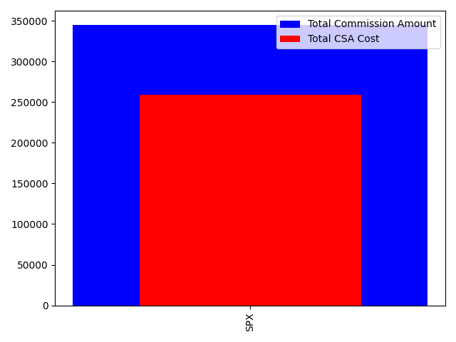

# Part 1:  Provide a summary of CSA by Account and in aggregate that shows the dollar value assessed and the relative portion of total commissions that went to CSA.

| Account    |   Commission |   total_csa_cost | portion_to_csa   |
|:-----------|-------------:|-----------------:|:-----------------|
| account_26 |       333928 |           250446 | 75.0%            |
| account_12 |         2080 |             1560 | 75.0%            |
| account_25 |         1484 |             1113 | 75.0%            |
| account_13 |          984 |              738 | 75.0%            |
| account_28 |          964 |              723 | 75.0%            |
| account_30 |          908 |              681 | 75.0%            |
| account_14 |          892 |              669 | 75.0%            |
| account_8  |          808 |              606 | 75.0%            |
| account_11 |          564 |              423 | 75.0%            |
| account_31 |          448 |              336 | 75.0%            |
| account_22 |          408 |              306 | 75.0%            |
| account_32 |          408 |              306 | 75.0%            |
| account_23 |          404 |              303 | 75.0%            |
| account_27 |          300 |              225 | 75.0%            |
| account_29 |          220 |              165 | 75.0%            |
| account_10 |          212 |              159 | 75.0%            |

# Part 2:  Provide a summary of Commissions and CSA by Underlying (Column Q).  This can be done in Aggregate and doesn't need to be done by account. 

| Underlying   |   Commission |   total_csa_cost | portion_to_csa   |
|:-------------|-------------:|-----------------:|:-----------------|
| SPX          |       345012 |           258759 | 75.0%            |

