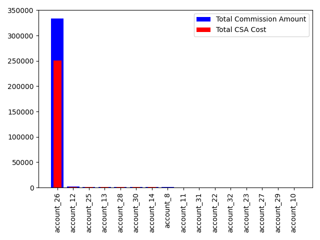

# Part 1:  Provide a summary of CSA by Account and in aggregate that shows the dollar value assessed and the relative portion of total commissions that went to CSA.
| Account    | Commission   | total_csa_cost   | portion_to_csa   |
|:-----------|:-------------|:-----------------|:-----------------|
| account_26 | $3,339.28    | $2,504.46        | 75.00%           |
| account_12 | $20.80       | $15.60           | 75.00%           |
| account_25 | $14.84       | $11.13           | 75.00%           |
| account_13 | $9.84        | $7.38            | 75.00%           |
| account_28 | $9.64        | $7.23            | 75.00%           |
| account_30 | $9.08        | $6.81            | 75.00%           |
| account_14 | $8.92        | $6.69            | 75.00%           |
| account_8  | $8.08        | $6.06            | 75.00%           |
| account_11 | $5.64        | $4.23            | 75.00%           |
| account_31 | $4.48        | $3.36            | 75.00%           |
| account_22 | $4.08        | $3.06            | 75.00%           |
| account_32 | $4.08        | $3.06            | 75.00%           |
| account_23 | $4.04        | $3.03            | 75.00%           |
| account_27 | $3.00        | $2.25            | 75.00%           |
| account_29 | $2.20        | $1.65            | 75.00%           |
| account_10 | $2.12        | $1.59            | 75.00%           |

# Part 2:  Provide a summary of Commissions and CSA by Underlying (Column Q).  This can be done in Aggregate and doesn't need to be done by account. 

| Underlying   | Commission   | total_csa_cost   | portion_to_csa   |
|:-------------|:-------------|:-----------------|:-----------------|
| SPX          | $3,450.12    | $2,587.59        | 75.00%           |

# Part 3: Summary of Trans Net Amt
| Account    |   Total Abs Val Quantity | Total Abs Val Trans Net Amt   | commission_trans   | csa_trans   | Commission   | total_csa_cost   | portion_to_csa   |
|:-----------|-------------------------:|:------------------------------|:-------------------|:------------|:-------------|:-----------------|:-----------------|
| account_10 |                       53 | $1,839.16                     | 0.12%              | 0.09%       | $2.12        | $1.59            | 75.00%           |
| account_11 |                      141 | $4,842.47                     | 0.12%              | 0.09%       | $5.64        | $4.23            | 75.00%           |
| account_12 |                      520 | $16,692.84                    | 0.12%              | 0.09%       | $20.80       | $15.60           | 75.00%           |
| account_13 |                      246 | $15,644.73                    | 0.06%              | 0.05%       | $9.84        | $7.38            | 75.00%           |
| account_14 |                      223 | $11,868.66                    | 0.08%              | 0.06%       | $8.92        | $6.69            | 75.00%           |
| account_22 |                      102 | $3,399.07                     | 0.12%              | 0.09%       | $4.08        | $3.06            | 75.00%           |
| account_23 |                      101 | $3,377.93                     | 0.12%              | 0.09%       | $4.04        | $3.03            | 75.00%           |
| account_25 |                      371 | $22,815.85                    | 0.07%              | 0.05%       | $14.84       | $11.13           | 75.00%           |
| account_26 |                    83482 | $2,746,598.31                 | 0.12%              | 0.09%       | $3,339.28    | $2,504.46        | 75.00%           |
| account_27 |                       75 | $562.82                       | 0.53%              | 0.40%       | $3.00        | $2.25            | 75.00%           |
| account_28 |                      241 | $8,005.53                     | 0.12%              | 0.09%       | $9.64        | $7.23            | 75.00%           |
| account_29 |                       55 | $1,982.36                     | 0.11%              | 0.08%       | $2.20        | $1.65            | 75.00%           |
| account_30 |                      227 | $8,799.48                     | 0.10%              | 0.08%       | $9.08        | $6.81            | 75.00%           |
| account_31 |                      112 | $4,378.47                     | 0.10%              | 0.08%       | $4.48        | $3.36            | 75.00%           |
| account_32 |                      102 | $3,924.18                     | 0.10%              | 0.08%       | $4.08        | $3.06            | 75.00%           |
| account_8  |                      202 | $12,651.62                    | 0.06%              | 0.05%       | $8.08        | $6.06            | 75.00% 
| Underlying   |   Total Abs Val Quantity | Total Abs Val Trans Net Amt   | commission_trans   | csa_trans   | Commission   | total_csa_cost   | portion_to_csa   |
|:-------------|-------------------------:|:------------------------------|:-------------------|:------------|:-------------|:-----------------|:-----------------|
| SPX          |                    86253 | $2,867,383.48                 | 0.12%              | 0.09%       | $3,450.12    | $2,587.59        | 75.00%   

## By Buy/Sell
|                        |   Quantity | Trans Net Amt   | commission_trans   | csa_trans   | Commission   | total_csa_cost   | portion_to_csa   |
|:-----------------------|-----------:|:----------------|:-------------------|:------------|:-------------|:-----------------|:-----------------|
| ('account_10', 'Buy')  |         27 | $982.61         | 0.11%              | 0.08%       | $1.08        | $0.81            | 75.00%           |
| ('account_10', 'Sell') |        -26 | $-856.55        | 0.12%              | 0.09%       | $1.04        | $0.78            | 75.00%           |
| ('account_11', 'Buy')  |         73 | $2,618.66       | 0.11%              | 0.08%       | $2.92        | $2.19            | 75.00%           |
| ('account_11', 'Sell') |        -68 | $-2,223.81      | 0.12%              | 0.09%       | $2.72        | $2.04            | 75.00%           |
| ('account_12', 'Buy')  |        268 | $9,056.54       | 0.12%              | 0.09%       | $10.72       | $8.04            | 75.00%           |
| ('account_12', 'Sell') |       -252 | $-7,636.30      | 0.13%              | 0.10%       | $10.08       | $7.56            | 75.00%           |
| ('account_13', 'Buy')  |        129 | $8,687.93       | 0.06%              | 0.04%       | $5.16        | $3.87            | 75.00%           |
| ('account_13', 'Sell') |       -117 | $-6,956.80      | 0.07%              | 0.05%       | $4.68        | $3.51            | 75.00%           |
| ('account_14', 'Buy')  |        117 | $6,519.54       | 0.07%              | 0.05%       | $4.68        | $3.51            | 75.00%           |
| ('account_14', 'Sell') |       -106 | $-5,349.12      | 0.08%              | 0.06%       | $4.24        | $3.18            | 75.00%           |
| ('account_22', 'Buy')  |         53 | $1,866.69       | 0.11%              | 0.09%       | $2.12        | $1.59            | 75.00%           |
| ('account_22', 'Sell') |        -49 | $-1,532.38      | 0.13%              | 0.10%       | $1.96        | $1.47            | 75.00%           |
| ('account_23', 'Buy')  |         52 | $1,845.55       | 0.11%              | 0.08%       | $2.08        | $1.56            | 75.00%           |
| ('account_23', 'Sell') |        -49 | $-1,532.38      | 0.13%              | 0.10%       | $1.96        | $1.47            | 75.00%           |
| ('account_25', 'Buy')  |        192 | $12,743.04      | 0.06%              | 0.05%       | $7.68        | $5.76            | 75.00%           |
| ('account_25', 'Sell') |       -179 | $-10,072.82     | 0.07%              | 0.05%       | $7.16        | $5.37            | 75.00%           |
| ('account_26', 'Buy')  |      43003 | $1,489,304.54   | 0.12%              | 0.09%       | $1,720.12    | $1,290.09        | 75.00%           |
| ('account_26', 'Sell') |     -40479 | $-1,257,293.77  | 0.13%              | 0.10%       | $1,619.16    | $1,214.37        | 75.00%           |
| ('account_27', 'Buy')  |         39 | $314.99         | 0.50%              | 0.37%       | $1.56        | $1.17            | 75.00%           |
| ('account_27', 'Sell') |        -36 | $-247.83        | 0.58%              | 0.44%       | $1.44        | $1.08            | 75.00%           |
| ('account_28', 'Buy')  |        124 | $4,422.91       | 0.11%              | 0.08%       | $4.96        | $3.72            | 75.00%           |
| ('account_28', 'Sell') |       -117 | $-3,582.62      | 0.13%              | 0.10%       | $4.68        | $3.51            | 75.00%           |
| ('account_29', 'Buy')  |         28 | $1,030.35       | 0.11%              | 0.08%       | $1.12        | $0.84            | 75.00%           |
| ('account_29', 'Sell') |        -27 | $-952.01        | 0.11%              | 0.09%       | $1.08        | $0.81            | 75.00%           |
| ('account_30', 'Buy')  |        118 | $4,761.29       | 0.10%              | 0.07%       | $4.72        | $3.54            | 75.00%           |
| ('account_30', 'Sell') |       -109 | $-4,038.19      | 0.11%              | 0.08%       | $4.36        | $3.27            | 75.00%           |
| ('account_31', 'Buy')  |         58 | $2,369.66       | 0.10%              | 0.07%       | $2.32        | $1.74            | 75.00%           |
| ('account_31', 'Sell') |        -54 | $-2,008.80      | 0.11%              | 0.08%       | $2.16        | $1.62            | 75.00%           |
| ('account_32', 'Buy')  |         53 | $2,124.65       | 0.10%              | 0.07%       | $2.12        | $1.59            | 75.00%           |
| ('account_32', 'Sell') |        -49 | $-1,799.52      | 0.11%              | 0.08%       | $1.96        | $1.47            | 75.00%           |
| ('account_8', 'Buy')   |        106 | $7,008.35       | 0.06%              | 0.05%       | $4.24        | $3.18            | 75.00%           |
| ('account_8', 'Sell')  |        -96 | $-5,643.27      | 0.07%              | 0.05%       | $3.84        | $2.88            | 75.00% 

|                 |   Quantity | Trans Net Amt   | commission_trans   | csa_trans   | Commission   | total_csa_cost   | portion_to_csa   |
|:----------------|-----------:|:----------------|:-------------------|:------------|:-------------|:-----------------|:-----------------|
| ('SPX', 'Buy')  |      44440 | $1,555,657.30   | 0.11%              | 0.09%       | $1,777.60    | $1,333.20        | 75.00%           |
| ('SPX', 'Sell') |     -41813 | $-1,311,726.18  | 0.13%              | 0.10%       | $1,672.52    | $1,254.39        | 75.00%   
